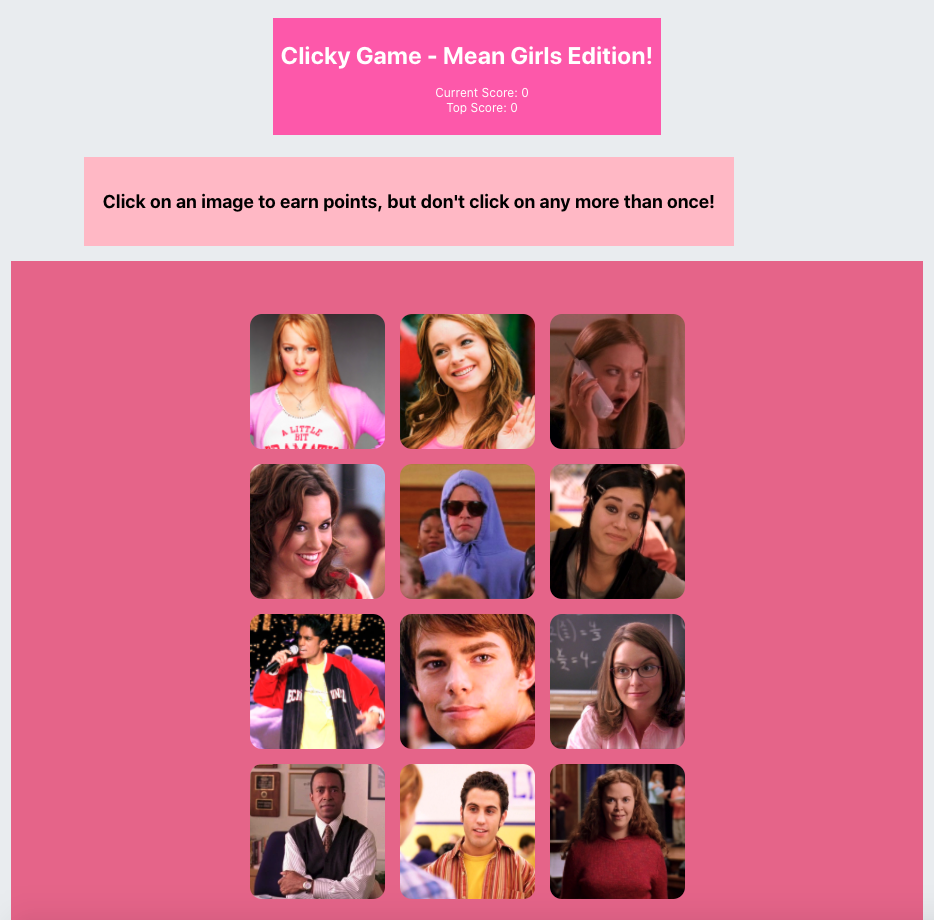

# clicky-game2

Copied over from my original repo, tashonasmith/Clicky-Game.

Clicky Game is an interactive memory game.  

The user is presented with 12 images.  In order to achieve the highest possible score, the user must click each image only once.  If an image is clicked more than once during the same round, the user’s score will reset to 0, and they will have to start over.

Built with React.

[Play the game](https://tashonasmith.github.io/clicky-game2/)

